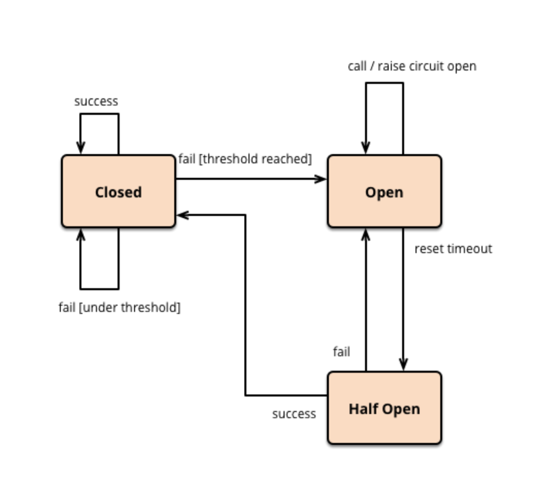

# circuit_breaker_pattern

## 1. 필요한 이유

외부 API 호출과 같은 remote call시, 호출 실패나 hang 등을 고려하지 않을 수가 없습니다. 일시적이고 단발성인 오류는 적절히 timeout을 주고 오류를 try-catch하면 되지만, 오류가 장시간 계속 발생할 때는 이런 방식으로 해결할 수 없는 경우가 발생합니다. 응답을 받지 못한 request가 timeout이 되는 시간까지 쓰레드풀이나 DB풀을 선점하고 있거나, 메모리를 잡아 먹으면서 점차 리소스는 부족해지고, 같은 리소스를 사용하고 있는 다른 부분들에도 순식간에 장애가 전파되기 시작합니다.

이 문제를 해결하기 위해서는

1. 오류가 전파되지 않도록 공유하고 있는 리소스를 분리하는 방법
2. 오류 발생시 오랫동안 리소스를 잡아두지 못하게 하는 방법(**Circuit Breaker Pattern**)

## 2. 정의

circuit breaker의 영어 뜻은 회로차단기이다. 이러한 이름을 딴 이유는 전기의 회로차단기에서 차용한 개념이여서이다.
회로가 close될때는 정상적으로 전기가 흐르다가 문제가 생기면 회로를 open하여 더이상 전기가 흐르지 않도록 한 것과 같이, 평소(close state)에는 정상적으로 동작하다가, 오류 발생시(Open state)로 변경하여 더이상 동작하지 않도록 합니다. 이렇게 문제가 되는 기능 자체를 동작하지 않게 해서 리소스를 점유하지 않게 하는 겁니다.

물론 전류가 복구되면 다시 정상화 되는 회로차단기처럼, 기능이 복구되면 다시 서비스를 정상화시켜야 한다. 일정 시간이 지났다고 무작정 정상 상태(close state)로 돌리면, request가 갑자기 몰리면서 문제가 다시 발생한다. 그래서 일부 request만 실행해보면서 기능이 다시 정상적으로 동작하는지 확인하는 과정(Half open state)이 필요합니다. 그렇게 정상화되었다고 판단되면 다시 원래 상태(Close state)로 복구하게 됩니다.

### 2.1 실제 MSA에서 사용되어지는 Circuit Breaker 패턴

서비스 호출 중간 ServiceA와 ServiceB 사이에 Circuit Breaker를 설치한다. Service B로의 모든 호출은 이 Circuit Breaker를 통하게 되고 Service B가 정상적인 상황에서는 트래픽을 문제없이 bypass한다.

만약에 Service B가 문제가 생겼음을 Circuit Breaker가 감지한 경우에는 Service B로의 호출을 강제적으로 끊어서 Service A에서 쓰레드들이 더 이상 요청을 기다리지 않도록 해서 장애가 전파되는 것을 방지한다. 강제적으로 호출을 끊으면 에러 메시지가 Service A에서 발생하기 때문에 장애 전파는 막을 수 있지만, Service A에서 이에 대한 장애 처리 로직이 별도로 필요하다.
이를 조금 더 발전 시킨것이 Fall-back 메시징인데, Circuit breaker에서 Service B가 정상적인 응답을 할 수 없을 때, Circuit breaker가 룰에 따라서 다른 메시지를 리턴하게 하는 방법이다.

예를 들어, Service A가 상품 목록을 화면에 뿌려주는 서비스이고, Service B가 사용자에 대해서 머신러닝을 이용하여 상품을 추천해주는 서비스라고 했을때, Service B가 장애가 나면 상품 추천을 해줄 수 없다.
이때 상품 진열자(MD)등이 미리 추천 상품 목록을 설정해놓고, Service B가 장애가 난 경우 Circuit breaker에서 이 목록을 리턴해주게 하면 머신러닝 알고리즘 기반의 상품 추천보다는 정확도는 낮아지지만 최소한 시스템이 장애가 나는 것을 방지 할 수 있고 다소 낮은 확률로라도 상품을 추천하여 꾸준하게 구매를 유도할 수 있다.
위 패턴든 넷플릭스에서 자바 라이브러리인 Hystrix로 구현이 되어있다. spring프레임웍에서도 손쉽게 적용 가능하다.

## 3. Hystrix

넷플릭스가 Circuit breaker패턴을 자바 기반으로 오픈소스화한 라이브러리이다.
Circuit breaker 자체를 구현한것 뿐만 아니라, 각 서비스의 상태를 한눈에 알아볼 수 있도록 대쉬보드를 같이 제공한다.

## 참조

1. [Circuit Breaker 패턴](https://velog.io/@vies00/Circuit-Breaker-Pattern)
2. [조대협의 블로그](https://bcho.tistory.com/1247)